Data Analysis
================
Shivangi

- Because Roe v. Wade is a highly politicized issue that has gained
  media attention that has varied over the years, we wanted to analyze
  pregnancy and abortion rates in the context of political affiliation
  and chronological year. In addition to political affiliation and
  changes over time, we are also interested in how these changing
  factors influence pregnancy and abortion rates by year.
- We are interested in investigating the degree to which pregnancy and
  abortion rates have changed over time and how these trends have
  changed depending on age group of the mother within the context of
  political affiliation.
- Our main questions that we hope to answer with our analysis and data
  modeling are: How does state’s party affiliation affect abortion
  rates, births, and miscarriages? How have the age of pregnant mothers
  and abortion rates changed over time?

## Initial Analysis

### Impact of Political Affiliation on Abortion Rate

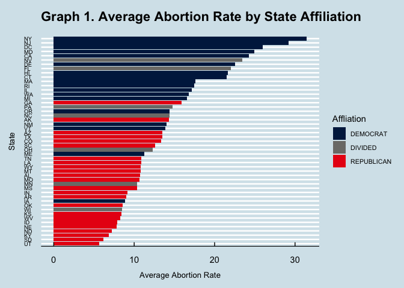<!-- -->

- We began our analysis by graphing the average abortion rate of each
  state as a horizontal bar graph with each bar color coded by state
  affiliation(Democrats, Republicans, or Divided).

- From our plot, we saw some noticeable trends. The states with the
  highest average abortion rates were almost entirely Democratically
  affiliated. The states with the lowest average abortion rates were
  almost entirely Republican affiliated. Some exceptions to these trends
  are Nevada and Florida, which are states with high abortion rate but
  are not fully Democratically affiliated. More exceptions to the trend
  of low abortion rate states being fully Republican affiliated are
  Wisconsin, Iowa, Minnesota, Maine, and Ohio. Wisconsin, Minnesota, and
  Ohio are divided states who have low abortion rates, while Iowa and
  Maine are Democratic Affiliated states with low abortion rates.

### Impact of Political Affiliation on Pregnancy Rate

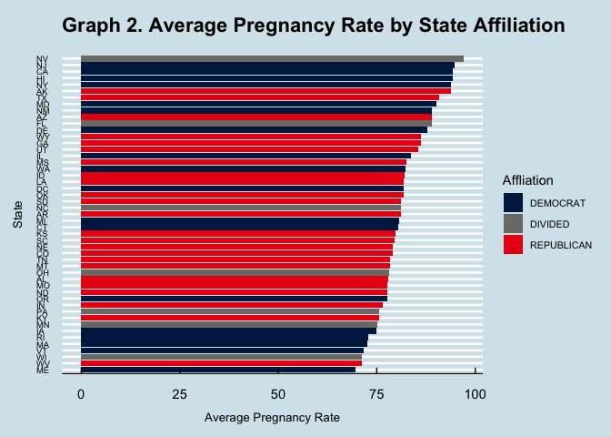<!-- -->

- Next, we decided to look at average pregnancy rate by state
  affiliation in order to see if there were also any noticeable trends.
  It was actually surprising to see how the graph was spread out.

- The states with the highest average pregnancy rate are Nevada, New
  Jersey, California, Hawaii, New York, and Alaska. All of these states
  except for Nevada, a divided state, and Alaska, a Republican
  affiliated state, are Democratically affiliated. The states with the
  lowest average pregnancy rate are Maine, West Virginia, Wisconsin,
  Vermont, Massachusetts, and Rhode Island. All of these states except
  for West Virginia, a Republican affiliated state, and Wisconsin, a
  divided state, are Democratically affiliated. A majority of the
  Republican affiliated states are centralized on this graph, meaning
  they stand in the middle, with a few Democratically affiliated states
  and divided states sprinkled between them.

### Impact of Age of Childbearer over the Years on Pregnancy Rate

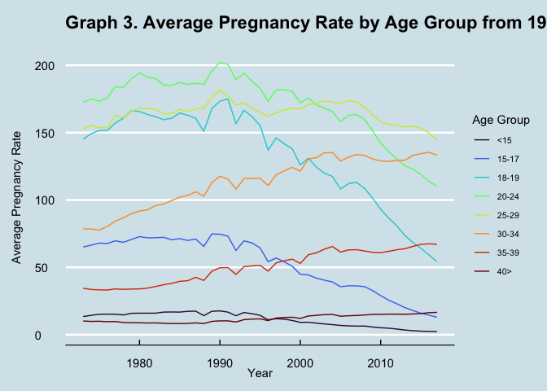<!-- -->

- Next, we wanted to see the average pregnancy rate for different age
  groups over the last 50 years.

- From our graph, we can see each age group as its own line that we can
  look at individually or all together. If we look at the plot as a
  whole, we can see that there was a shift in almost every adjacent line
  crosses each other around the years 1995 to 2002. Prior to 2002, 20-24
  year olds had a higher average pregnancy rate than 25-29 year olds,
  but after 2002, 25-29 year olds started having a higher average
  pregnancy rate than 20-24 year olds. Prior to 2002, 18-19 year olds
  had a higher average pregnancy rate than 30-34 year olds, but after
  2002, 30-34 year olds started having a higher average pregnancy rate
  than 18-19 year olds. Prior to 1998, 15-17 year olds had a higher
  average pregnancy rate than 35-39 year olds, but after 1998, 35-39
  year olds started having a higher average pregnancy rate than 15-17
  year olds. Lastly, prior to 1996, \<15 year olds had a higher average
  pregnancy rate than 40\> year olds, but after 1996, 40\> year olds
  started having a higher average pregnancy rate than \<15 year olds.

- Now we looked at each line individually. The average pregnancy rate of
  20-24 year olds, 18-19 year olds, 15-17 year olds, \<15 year olds has
  been decreasing ever since 1990. The average pregnancy rates of 30-34
  year olds, 35-39 year olds, and 40\> year olds has been increasing
  since around 1990. The average pregnancy rate of 25-29 year olds has
  been fluctuating since 1973.

- In 1973, the order of highest to lowest pregnancy by age group was
  20-24 year olds, 25-29 year olds, 28-19 year olds, 30-34 year olds,
  15-17 year olds, 35-39 year olds, \<15 year olds, then 40\> year olds.
  In 2017, the order of highest to lowest pregnancy rate became 25-29
  year olds, 30-34 year olds, 20-24 year olds, 35-39 year olds, 18-19
  year olds, 40\> year olds, 15-17 year olds, then \<15 year olds. From
  this trend we can say that as years have gone by on average, less
  teenagers have been getting pregnant and more adult women have been
  getting pregnant.

### Impact of Age of Childbearer over the Years on Abortion Rate

<!-- -->

- Next, we wanted to see the average abortion rate for different age
  groups over the last 50 years.

- Looking at the graph as a whole, it is clear to see that in general,
  the average abortion rate of all age groups is lower now than it was
  in 1973. Similarly to the previous graph, almost every adjacent age
  group lines cross each other at some point, except for the lines of
  age groups 30-34 year olds and 35-39 year olds which do not cross at
  any point. Prior to 1991, 18-19 year olds had a higher average
  abortion rate than 20-24 year olds, then after 1991, 20-24 year olds
  started having a higher abortion rate than 18-19 year olds. From
  1973-1988, the average abortion rate of 25-29 year old and 15-17 year
  olds cross each other continuously, then after 1988 the lines diverge
  where the average abortion rate of 25-29 becomes much higher than the
  average abortion rate of 15-17 year olds. Prior to 2005, the average
  abortion rate of \<15 year olds is higher than the average abortion
  rate of 40\> year olds, then after 2005 the lines overlap for a few
  years before diverging to 40\> year olds having a higher average
  abortion rate than \<15 year olds.

- Now looking at the lines individually, we can see that the average
  abortion rate of 18-19 year olds, 20-24 year olds, 15-17 year old, and
  \<15 year olds has been in a general decline since around 1988. The
  average abortion rate of 25-29 year olds, 30-34 year olds, 35-39 year
  olds, and 40\> year olds has stayed fairly consistent for the last 50
  years. With these trends we can say that on average young women and
  teenagers have been getting less abortions since 1988, while women
  over the age if 25 have not really changed the frequency of abortions.

### Impact of Politcal Affiliation AND Age of Childbearer on Pregnancy Rate

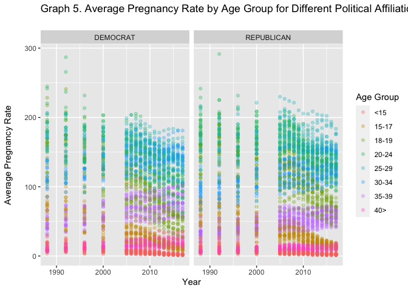<!-- -->

- Next, we wanted to see if political affiliation of state had any
  affect on average pregnancy rate by age group.

- On general, it looks like the average pregnancy rate by age group seem
  the same for Democrat affiliated states and Republican affiliated
  states. However, if we look closer, there are some subtle differences
  between the two.

- In 2017, for Democrat affiliated states, the average pregnancy rate of
  25-29 year olds and 30-34 year olds overlap each other as the age
  group with the highest average abortion rate, while for Republican
  affiliated states, the average pregnancy rate of 25-29 year olds is
  higher than 30-34 year olds. Another difference is that in 2017, the
  average abortion rate for 35-39 year olds in Democrat affiliated
  states is higher than 18-19 year olds, while the opposite is true in
  Republican affiliated states. In 2017, the average pregnancy rate of
  40\> year olds is higher than 15-17 year olds in Democrat affiliated
  states, while these two group overlap in Republican affiliated states.

### Impact of Politcal Affiliation AND Age of Childbearer on Abortion Rate

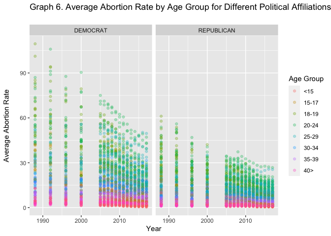<!-- -->

- Next, we wanted to see if political affiliation of state had any
  affect on average abortion rate by age group.

- Unlike the previous graph, the is a clear visual difference between
  average abortion rate in Democrat affiliated states and Republican
  affiliated states. In general, it seems that the overall abortion rate
  is higher in Democrat affiliated states than in Republican affiliated
  states. Within each state affiliation, the order from highest to
  lowest average abortion rate is generally the same. Some small
  differences are that the average abortion rate of 20-24 year olds in
  Republican affiliated states have a slightly higher than 25-29 year
  olds, while in Democrat affiliated states they two age groups overlap,
  and the average abortion rate of \<15 year olds is slightly lower than
  40\> year olds in Democrat affiliated states, while in Republican
  affiliated states the two age groups overlap.

## Modeling

### Average Pregnancy Rate of Teenagers over the last 50 years

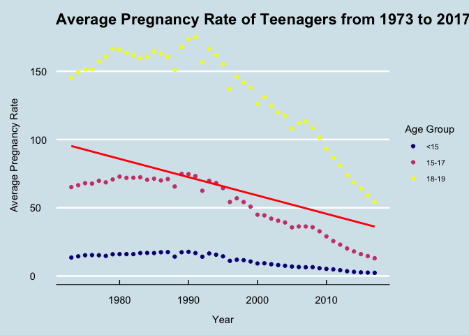<!-- -->

- We wanted to see the trend of teen pregnancy, so we created a model
  which predicts the Average Pregnancy Rate among teenagers. One
  limitation of this model is that it does not include any information
  on abortion or political affiliation. However, paired with our other
  visualizations, this linear model provides foundational information
  regarding the potential relationships between teen pregnancies,
  abortion, and abortion laws. Importantly, the trend line helps us to
  visualize what we might see in years to come.

### Residuals for Teen Pregnancy Model

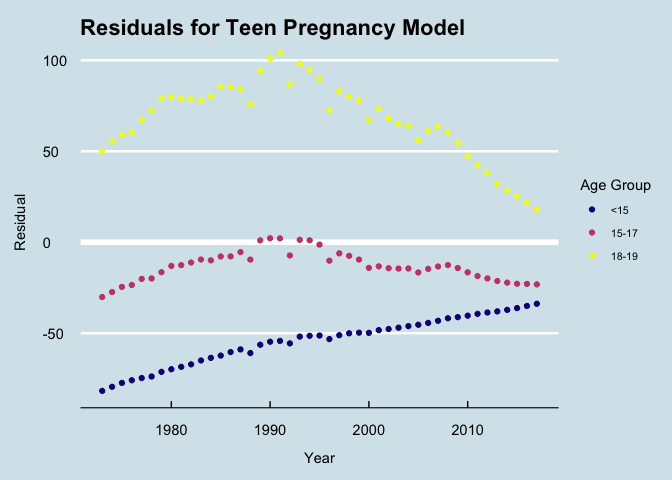<!-- -->

- This supplementary graph shows us how well our model is predicting
  Average Teen Pregnancy Rates. We see that this model is not adding
  much to the analysis of our project. Here, we are only using age as a
  predictor for pregnancy rates. Instead, we decided to try including
  more of our variables of interest as predictors, and to switch to
  abortion rates as our response variable, given our findings from our
  exploratory data analysis.

### Predicting Abortion Rate using Year, Age Group, and Political Affiliation as Predictors

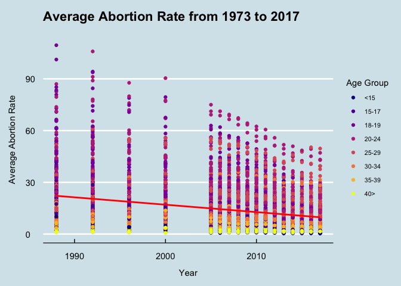<!-- -->

- Here, we modeled the same predictor (Year) with a different response
  variable (Abortion). We will compare this model with additional models
  that include multiple other predictor variables, including age,
  affiliation, and pre vs. post legalization of abortion.

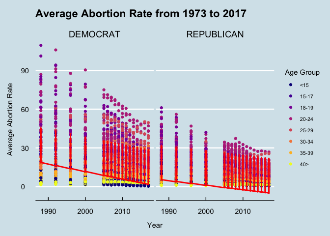<!-- -->

- Here we included year, age group, and affiliation as predictors for
  abortion rate.

### Predicting Abortion Rates before and after 1990s

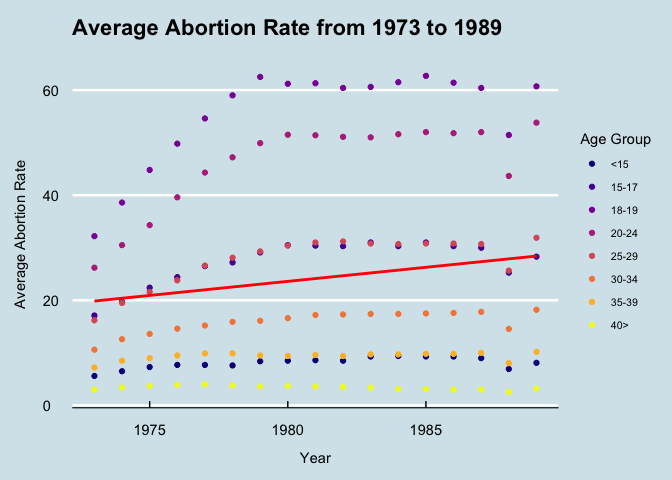<!-- -->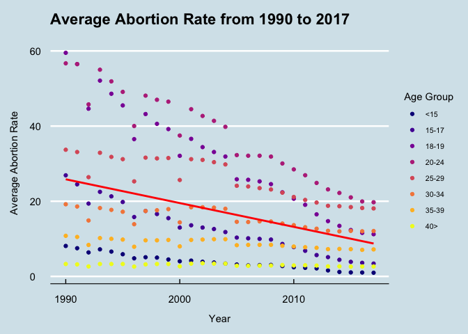<!-- -->

### Predicting Abortion Rates before and after 1990s

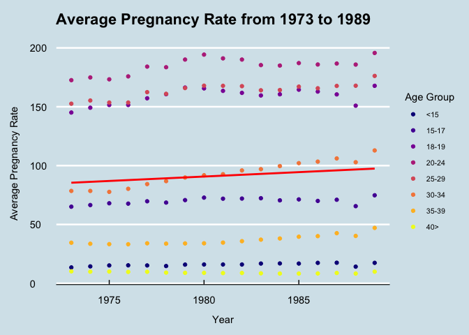<!-- --><!-- -->
