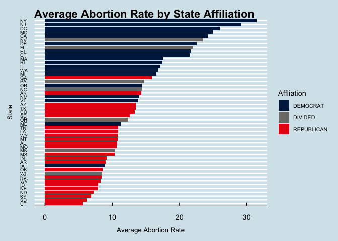
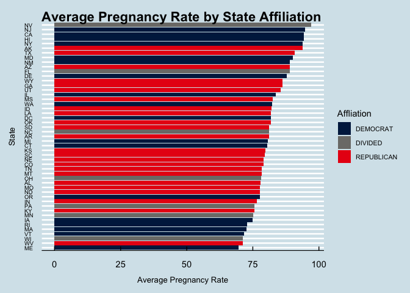
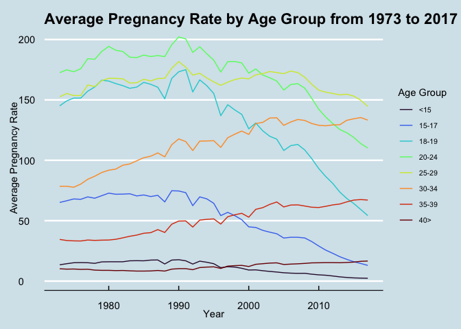
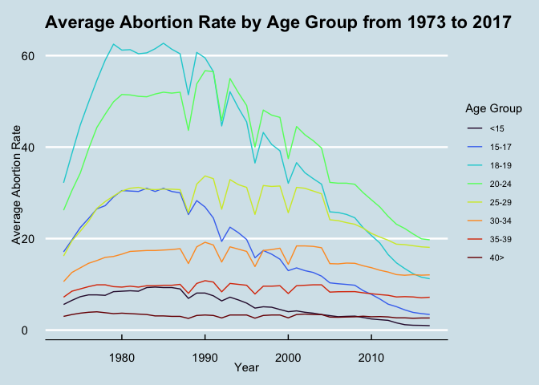
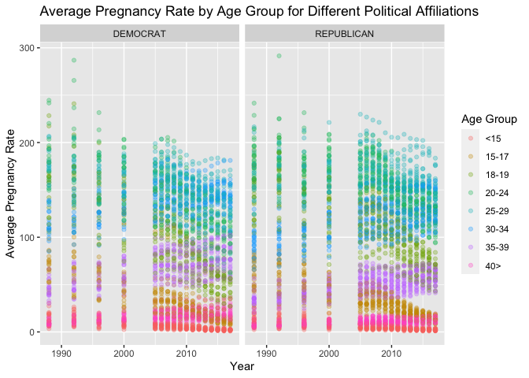
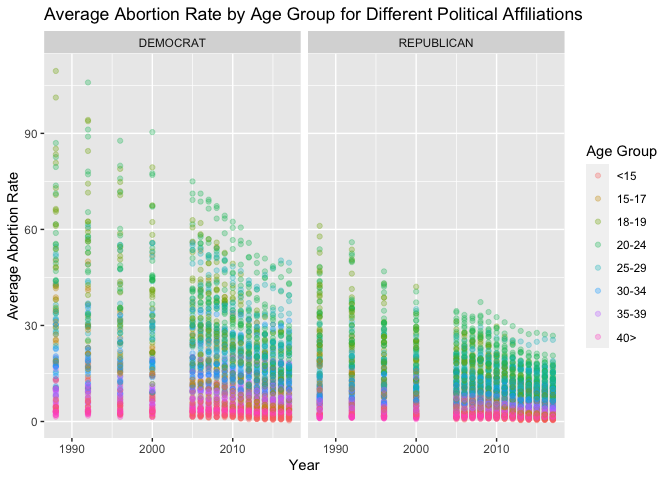

Pregnancy and Abortion Rates: Trends Over Time
================
Shivangi

## Abortion Rate is Impacted by Political Affiliation

- Based on the limited exploratory data analysis that we have conducted,
  it seems that pregnancy rate is not impacted by political affiliation,
  but abortion rate is. This is supported by the graphs 1 and 2 on our
  analysis page that show Average Pregnancy and Abortion Rate by State
  Affiliation. On the Abortion rate graph, there is a clear pattern
  where Democratic states have higher abortion rates as compared to
  Republican states. However, on the Pregnancy rate graph, this
  distinction is not as apparent.

<!-- -->

<!-- -->

## Over the Years, Less Teenage Pregnancy. More Waiting Til the 30s

- Over the last 30 years, it seems that the pregnancy rate for age
  groups 15-24 has significantly decreased, while the pregnancy rate for
  age groups 30-39 have increased. That is, childbearers seems to be
  getting pregnant later in life in recent years, as compared to
  teenagers.

### Is this why there are fewer abortions for Teens?

- For the abortion rate graph, we noticed an overall increase in
  abortions between years 1970-1980. This aligns with the legalization
  of abortion (the Supreme Court ruling of Roe v. Wade) in the US
  in 1973. After 1990, we notice a decrease in abortion rate for age
  groups 15-24.
- Or could it be other driving factors? Is it the political climate?

<!-- -->
<!-- -->

## Putting it All Together

### Pregnancy Rate Not Impacted by Political Affilation Across All Age Groups

- When we integrated the impact of our 2 variables of interest, we
  noticed that there was no significant difference in pregnancy rate
  over the years by political affiliation for any age group.

### Abortion Rate IS Impacted for Childbearers Aged 18-34 in Republican States

- However, when we did the same for abortion rate, there was a clear
  difference. That is, we noticed that the abortion rate of 15-17 year
  olds and people older that 35 are similar between the two political
  affiliations, but for the ages groups between those, 18-34 years old,
  have much higher average abortion rates in Democratic states than
  Republican states.

<!-- -->
<!-- --> —

## Link to Interactive Here

- [Interactive](https://sjchen23.shinyapps.io/Interactive/)

## Link to Video Here

- [Video](https://drive.google.com/file/d/162Pudjml1FVzSfz8dXjh5LHjfba39VuB/view?usp=sharing)

## In Summary

- Age of childbearer and time seem to impact pregnancy, but political
  affiliation may not.
- Over time, fewer teenagers are getting pregnant: instead it seems like
  people are waiting until their 30s.  
- Political affiliation, age of childbearer, and time all seem to impact
  abortion rates.
- Abortion rates peaked after 1973 after the ruling of Roe v Wade. They
  decreased after 1990 for teens and young adults. When broken down by
  political affiliation, ages groups 18-34 have much higher average
  abortion rates in Democratic states than Republican states.

## Other Factors to Consider

- Birth control: this analysis did not include prevalence of birth
  control usage over time, age group, or location. We imagine that this
  information would influence both pregnancy rates, and therefore
  abortion rates. Future analysis should include this information to
  tell the full story.
- Births and Miscarriages: To simplify our interpretation due to the
  time constraints of this project, we did not visualize the variables
  of births and miscarriages. If we had more time, our next steps would
  be to include these variables. We know that the decision to have an
  abortion may be multifaceted, and it is not uncommon for childbearers
  to require abortions due to birth complications and even miscarriages.
- Socio-economic status and demographics: Our data did not include this
  information, but we know that these factors can significantly impact
  access to healthcare (aka, birth control, education surrounding safe
  sex, and care during pregnancy). Future research should include these
  variables to better serve the full public.
- Today’s Political Climate: On June 24, 2022, Roe v. Wade was
  overturned. Unfortunately, our data were only collected until 2017.
  Given the recent changes in federal law, we know that state-specific
  laws have played a larger role in pregnancy and abortion-related
  decisions. Our story is not complete: given the initial spike in
  abortion rate that aligned with the historic ruling in 1973, we
  imagine that there would be some significant change and perhaps
  interaction between our variables of interest as a result of the
  recent policy changes.
